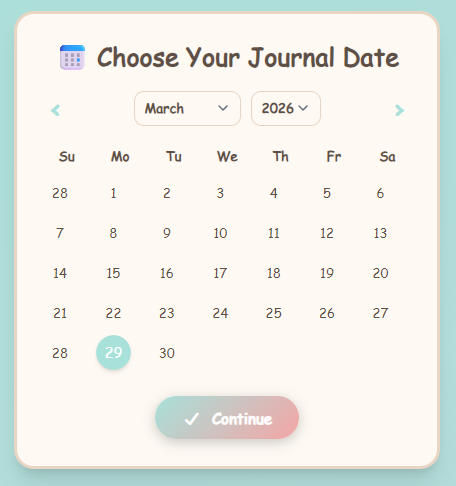
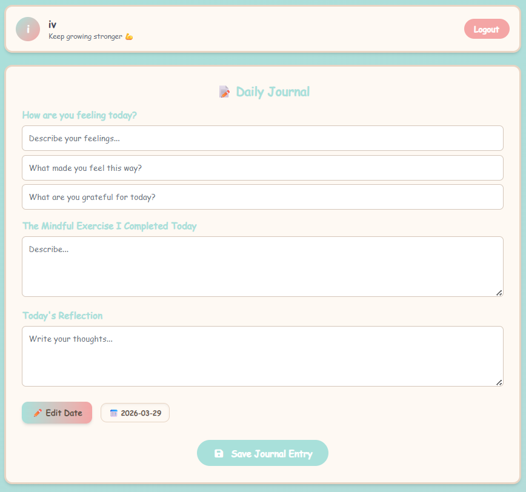
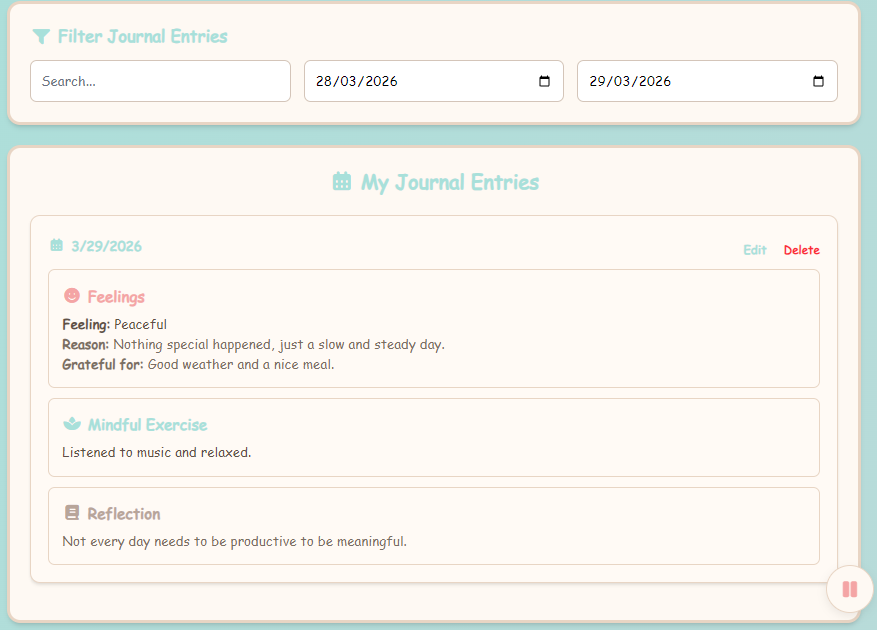
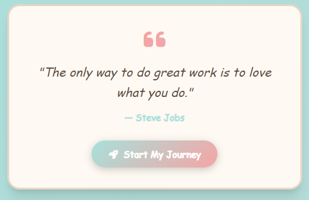

# 📝 Daily Journal Tracker

A simple journaling app to help you reflect, understand your emotions, and build a consistent habit of self-awareness.

---

A quiet place to slow things down.  
Not everything needs to be organized perfectly, sometimes you just need somewhere to write what the day felt like.  
This app is built around that idea, letting you capture thoughts, emotions, and small details that usually get lost.

  
  
  

Over time, these small entries start to form a pattern.  
You begin to notice what affects your mood, what you’re grateful for, and what stays with you longer than expected.

And sometimes, all it takes is a single sentence to shift your perspective.

  

---